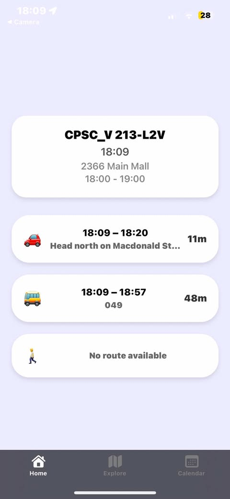
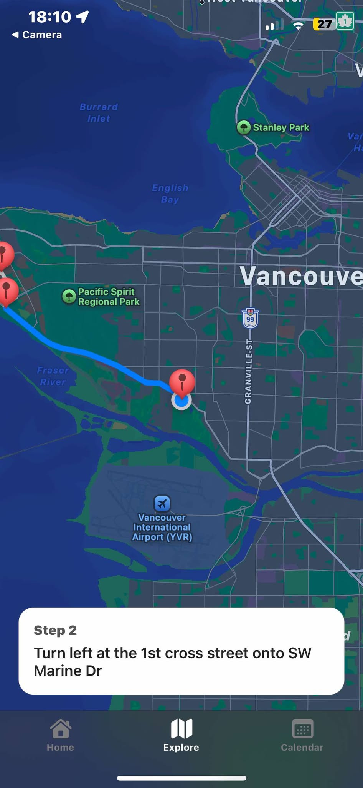
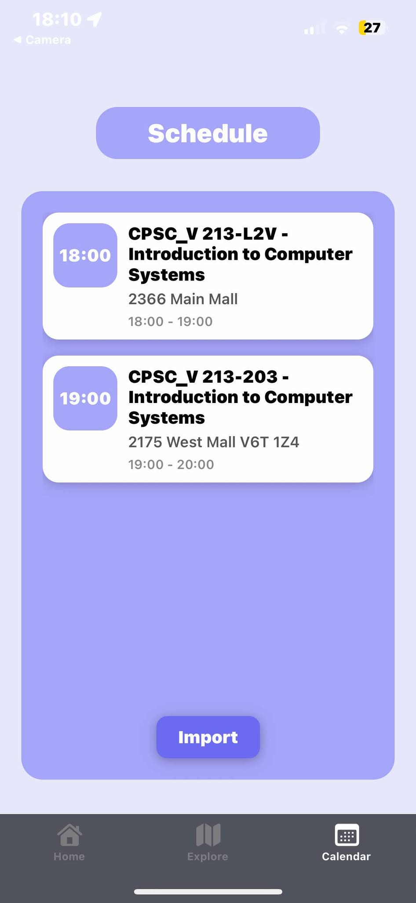

# QuackTrack – Your Smart School & Transit Companion

**QuackTrack** is a mobile app that helps students stay on top of their daily schedule and get to class on time — all with help from a friendly, talking duck mascot.  
Built with **FastAPI** and **React Native (Expo)**, QuackTrack integrates school schedules, real-time bus tracking, and step-by-step navigation right into your home widget.

### ✨ Features at a Glance

##### 📅 Smart Schedule Detection
- Import class schedules from Workday `.xls` files.
- Automatically detects today’s classes and upcoming periods.

##### 🗺️ Real-Time Transit & Navigation
- Track bus locations live via **Google Maps API**.
- Get optimal walking, transit, or driving routes.
- Navigate with **live directions** and **class-time awareness**.

---

## Tech Stack
| Layer      | Technology & Services                                      |
|------------|-------------------------------------------------------------|
| Backend    | FastAPI, SQLAlchemy, Pandas, Uvicorn, **Hosted on Render**  |
| Frontend   | React Native (Expo), React Navigation                       |
| APIs       | Google Maps API, Device Location, Calendar                  |
| Database   | PostgreSQL, **Hosted on Neon**                              |

---

## Try It Instantly

### Quick Preview with Expo Go

No build needed — just scan and run:

1. Download **Expo Go**  
   - [iOS](https://apps.apple.com/app/expo-go/id982107779)  
   - [Android](https://play.google.com/store/apps/details?id=host.exp.exponent)

2. Scan the QR code below:

  

---

## Screenshots

<table>
  <tr>
    <td align="center">
      <strong>Home Widget</strong> 
      
    </td>
    <td align="center">
      <strong>Explore – Navigation</strong> 
      
    </td>
    <td align="center">
      <strong>Calendar View</strong> 
      
    </td>
  </tr>
</table>

---

## 📬 Contact

Have questions or feedback?

 
